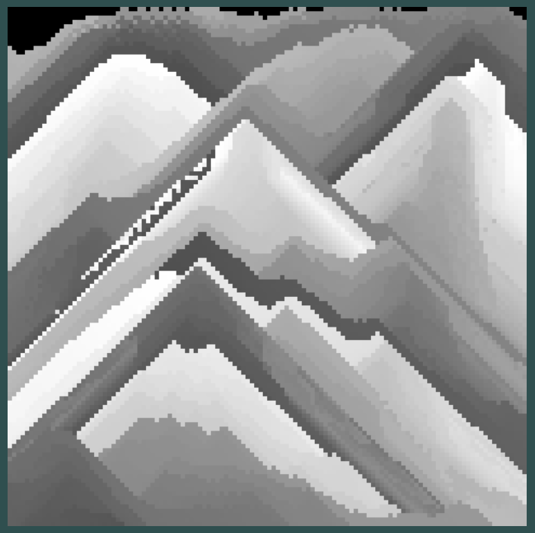

# Projeto de Canvas Interativo - Formação de Montanhas de Poeira

Este é um pequeno projeto desenvolvido por diversão, utilizando HTML e JavaScript para criar um canvas interativo. A ideia por trás deste projeto é simular a formação de montanhas de poeira na tela, onde cada clique adiciona partículas que interagem entre si e formam padrões interessantes.

## Funcionalidades

- **Clique Interativo:** Ao clicar na tela, novas partículas de poeira são adicionadas dinamicamente.

- **Física de Partículas:** As partículas têm uma física simples, movendo-se e interagindo com os pixels ao redor.

- **Mudança de Cor:** A mudança de cor das partículas pode criar padrões visuais interessantes, simulando a formação de montanhas.

## Demonstração

## Teste você mesmo!
[Github Pages - Dust in Canvas](https://bperdona.github.io/Dust-Physics-on-Canvas/)